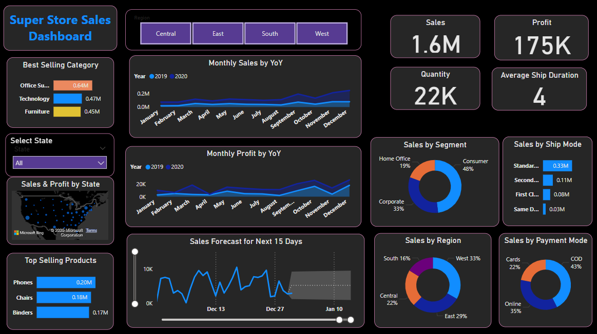

# Superstore Sales Dashboard

## 📌 Project Overview
This Power BI dashboard provides an analysis of Superstore sales performance, including:
- Sales & Profit trends
- Regional & Segment-wise performance
- Forecasting for inventory planning
- Shipping & Payment insights

## 🏆 Key Insights & Recommendations
- **Total Sales:** $1.6M, with strong Q4 performance.
- **Top Region:** West (33% of total sales).
- **Recommended Action:** Improve marketing in underperforming regions (South - 16%).

## 📂 Files in Repository
- `Superstore_Sales.pbix` → Power BI dashboard file
- `README.md` → Documentation with insights

## 🚀 How to Open & Use
1. Download the `.pbix` file.
2. Open it in **Power BI Desktop**.
3. Explore the interactive reports.

## 🔗 Connect with Me
[LinkedIn Profile](https://linkedin.com/in/your-profile) | [GitHub Profile](https://github.com/your-username)
